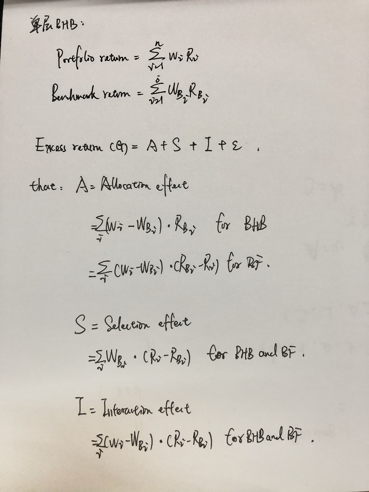

业绩归因模型：Brinson-Model
------

介绍：
------
Brison模型分为BF模型和BHB模型。
其中BF模型最早发布于1985年，由Brison 和 Fachler 的论文"Measuring Non-US Equity Portfolio Performance" 提出。 BHB模型则最早发布于1986年，由Brison，Hood，Beebower于1986年刊登于金融分析家杂志《Financial Analysts Journal》
的论文"Determinantes of Portfolio Performance"提出的归因模型。

其模型是基于收益、持仓、交易的业绩归因，是基金组合业绩归因的重要工具，借助基金具体的持仓信息，来实现基金当期收益的分解。 具体而言，可以将基金所持有的股票组合相对于基准股票组合的超额收益分为资产配置收益和个股选择收益，考虑到股票组合通常按照行业维度进行分类，因此可将基金投资股票部分的超额收益分解为行业配置收益和行业内的个股选择收益。

1，基于收益的归因：
此模型适用于对普遍大多数基金，因为国内基金大多数只在半年报和年报披露具体持仓。
此方法最为简单但存在一定误差，无法捕捉因为交易和调仓带来的差异。

2，基于持仓的归因：
此方法参考期初的投资持仓情况，利用每日、周、月数据计算。但交易效应将导致残差项的出现。所以此业绩归因方法更适合换手率低的策略，如被动投资策略。

3，基于交易的归因：
此方法最为精确，测量所有交易对收益的变化，但难度高且耗时。

API接口：AKShare

公式定理推导：
------

BHB/BF模型:
------

文件说明：
------
1.select_the_fund函数：

输入基金代码，起始日，结束日，并需要手动输入基金的锚定基准。

函数对组合的股票持仓比例矩阵，基准中股票的持仓比例矩阵进行分析，
对持仓进行分解，并根据历史行情和权重得出分解后组合对于各行业/类别的收益率，以及基准的收益率。

2.BHB_Model_Analysis函数：

计算所有单期截面的归因结果，通过调用BHB_Model_Analysis函数进行计算。

3.BF_Model_Analysis函数：

计算所有单期截面的归因结果，通过调用BF_Model_Analysis函数进行计算。应注意，BF和BHB模型得出的结论应一致。

输出结果：
------
以长信军工量化混合 002983 2021年第4季度业绩 为例：

业绩分解：

         行业   组合权重  基准权重  组合收益  基准收益
    0  军工行业  0.6992   0.6  0.252834  0.163853
    1  其他行业  0.2360   0.0  0.226698  0.043040
    2  货币基金  0.0648   0.4  0.012495  0.012495

业绩归因：

        配置效应    选股效应   交叉效应    误差
    0  0.022947  0.105559  0.05217  0.014515
